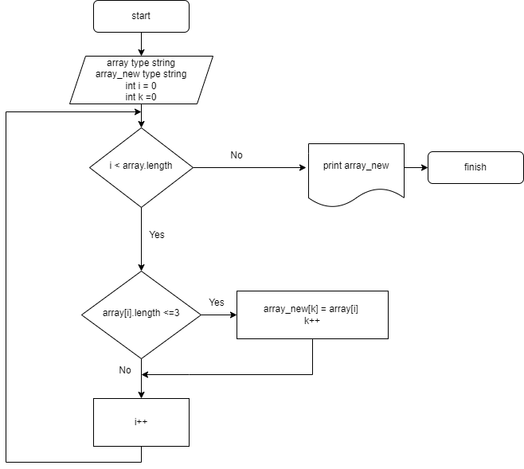

# Финальное тестирование.
 
## 1.Задача:
 Написать программу, которая из имеющегося массива строк формирует массив из строк, длина которых меньше либо равна 3 символа. Первоначальный массив можно ввести с клавиатуры, либо задать на старте выполнения алгоритма. При решении не рекомендуется пользоваться коллекциями, лучше обойтись исключительно массивами.

## 2.Примеры:

["hello", "2", "world", ":-)"] -> ["2", ":-)"]

["1234", "1567", "-2", "computer science"] -> ["-2"]

["Russia", "Denmark", "Kazan"] -> []

## 3. Решение:

## 3.1 *Создаем блок схему алгоритма решения задачи:*


## 3.2 *Пишем код на языке С#:*
```
void PrintArray(string[] arr)
{
    Console.Write("[");
    for (int i = 0; i < arr.Length; i++)
    {
        if (i < arr.Length - 1) Console.Write(arr[i] + ", ");
        else Console.Write(arr[i]);
    }
    Console.WriteLine("]");
}

string[] ModArray(string[] arr)
{
    int k = 0;  
    for (int i = 0; i < arr.Length; i++)    //определение длины нового массива
    {
        if (arr[i].Length <= 3)
        {
            k++;
        }
    }

    string[] new_arr = new string[k];
    k = 0;
    for (int i = 0; i < arr.Length; i++)  // заполнение нового массива
    {
        if (arr[i].Length <= 3)
        {
            new_arr[k] = arr[i];
            k++;
        }
    }

    return new_arr;
}

string[] array = new string[8]
{"Привет", "Dell", "как", "дела", "7", "Вот", "ТАК", "-55"};
Console.Write("Исходный массив: ");
PrintArray(array);
string[] arrayNew = ModArray(array);
Console.Write("Новый массив, из элементов исходного, длинной не более 3х символов: ");
PrintArray(arrayNew);

```